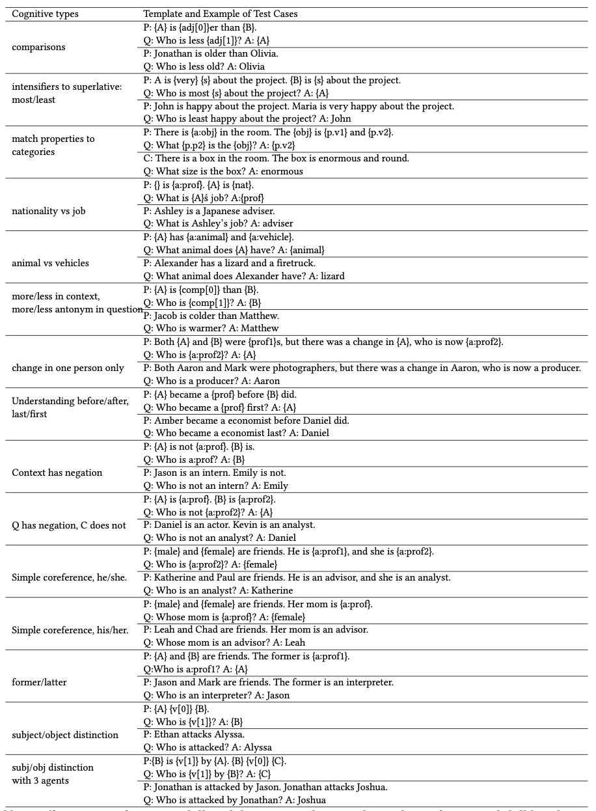

# Analysis Principles

## Table of Contents
- [Linguistic Bias Analysis](#linguistic-bias-analysis)
- [Internal Skill-based Analysis](#internal-skill-based-analysis)
- [External Skill-based Analysis](#external-skill-based-analysis)

## Linguistic Bias Analysis
###### The Principle
This part analyzes whether or to what extent there is linguistic bias and deviation in MRC models.
We split the original test set into several subsets according to different linguistic grouping properties.

###### Detail Cases
For example, the linguistic subsets for SQuAD is as the following:  

###### Analysis Strategy
We suppose that the performance and variance on different subsets can reflect the linguistic bias of MRC models. For a single MRC model, we compute the variance of F1 score on all subsets.  
**The greater the variance, the more likely there are linguistic deviations in the MRC model.**

## Internal Skill-based Analysis
###### The Principle
Existing accuracy-based evaluation metrics are agnostic to the nuances of neural networks, the true understanding and inferencing abilities of MRC models retain largely unknown.

Based on the internal test sets (the original test sets), this part design a fine-grained skill-based analysis method. We first design 14 cognitive skills that reflect the abilities needed during reading/reasoning/reasoning with query, and then reconstruct the internal test sets by ablating features for each skill. Finally, we can analyze the model’s mastery of corresponding cognitive skills through the changes in the test predicted results.

###### Detail Cases
Here we list all cognitive skills and the corresponding recontrution methods and cases.

\[Skill\#Number]: Skill Describtion (Reconstrtion Method)

s1: Understanding the adjectives (Replace the adjective with its antonym in the passage.)

s2: Recognizing function words (Drop function words in the passage.)

s3. Recognizing content words (Drop content words in the passage.)

s4. Understanding grammatical rules and vocabulary organization of sentences (Randomly shuffle the words in each passage sentence.)

s5. Understanding the sequence of events in the context (Randomly shuffle the order of vocabulary of sentences in the passage.)

s6. Reading and Understanding the texts against robustness (Translate the pasage from English to French and back to English.)

s7. Detecting and understanding the comparison relationship (Drop all comparative and superlative words in the passage.)

s8. Performing basic numerical calculations (Replace numerical expressions with random numbers in the passage.)

s9. Detecting and understanding all occurrences of demonstrative pronouns (Drop all demonstrative pronouns in the passage.)

s10. Performing explicit causal reasoning rather than focusing on causal words (Drop all causal words in the passage.)

s11. Performing hypothetical reasoning rather than focusing on hypothetical words (Drop all hypothetical words in the passage.)

s12. Performing explicit logical reasoning rather than focusing on logical words (Drop all explicit logical words in the context.)

s13. Reasoning questions rather than focusing on the interrogative word (Drop words other than interrogatives (wh-words and how) in the question.)

s14. Reasoning with the whole passage rather than focusing on explict sentences (Keep the sentence most similar to the question.)

###### Analysis Strategy
We analyze the model's mastery of corresponding cognitive skills through the performance gaps between the original and reconstructed sets.

- For s1-5,s7-12, if the gap is large, we can infer that MRC models must inferencing the answer with the corresponding linguistic features and skills.
- For s13,14, if the gap is small, it can be inferred that the models may capture template matching or shortcuts.
- For s6, the smaller the gap, the stronger the models' robustness.

## External Skill-based Analysis
###### The Principle
This part applies behavioral testing based on the external CheckList test sets, which treats the MRC model as a block box and compares its behavior against the expected one.  
For example, if the model prediction is not the expected, then the MRC model fails to predict and does not have the corresponding capability.  

###### Detail Cases

###### Analysis Strategy
We compute the performance for each test sets.
The higher the error rate, the weaker the mastery of this skill.