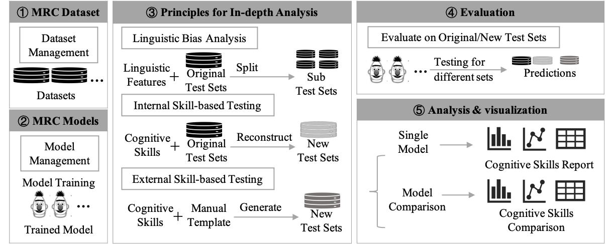

# InDepth-Eva-MRC
InDepth-Eva-MRC is an interactive and visualized platform to provide analysis from cognitive fine-grained for Machine Reading Comprehension(MRC) models.

The platform makes post-hoc systems to explain the behavior of MRC models. On the one hand, it analyzes the linguistic bias via performances with different linguistic properties. On the other hand, it performs skill-based analysis methods based on the modified test samples and semi-automatically generated test samples. Furthermore, through its detailed and interactive visualizations, the platform offers in-depth results analysis and model comparison from cognitive fine-grained.

The complete install and quick start documents are coming soon, and the demonstration video is available at [there](https://github.com/py-rgb/InDepth-Eva-MRC/blob/main/InDepth-Eva-MRC-Video.mp4) and [YouTube](https://youtu.be/MB_0exH0x0Q).

## :couple: Audiences
* **Researchers:** InDepth-Eva-MRC can easily help you to view the baseline model of MRC task, and provide fine-grained evaluation analysis of the model.
* **New to MRC:** InDepth-Eva-MRC can quickly help you understand the process of mrc tasks, and can also make you understand the model more clearly through fine-grained analysis.

## Overview Architecture

Our system consists of five main modules: 
* MRC Datasets
   * preloads five extractive MRC datasets: SQuAD 1.1, HotpotQA, Natural Questions, NewsQA, and TriviaQA.
   * manages datasets and provides basic operations, such as add, delete, update and search.
* MRC Models
   * preloads six popular MRC models: BIDAF, R-NET, BERT, Span-BERT, BLANC and GPT2.
   * provides the user interface to quickly train an MRC model by adjusting the corresponding hyper-parameters and training dataset.
* Principles for In-depth Analysis
   * describes three principles for in-depth analysis, including 1) linguistic bias analysis based on the original test sets; 2)internal skill-based analysis based on new reconstructed test sets; and 3) external skill-based analysis based on new generated test sets.
   * provides a flexible interface to reconstruct new test sets for internal skill-based analysis.
   * The complete principles, along with corresponding case examples and analysis strategies, are available at [Analysis Principles Document](https://github.com/py-rgb/InDepth-Eva-MRC/tree/main/Analysis%20Principles%20Document).
* Evaluation
   * evaluates the trained MRC model on the original new test sets and lists all results and supports illustrating each sample for a case study.
   * users can also download all kinds of test sets and upload their prediction files to the platform.
* Analysis & Visualization
   * Visualization for Single Model
      * linguistic bias analysis
      * internal skill-based analysis
      * external skill-based analysis
   * Visualization for Model Comparison
      * provides cognitive comparison between two different MRC models.
      * presents the comparsion, conclusion and case studies for three analysis principles.

   
## How to Use
In conclusion, InDepth-Eva-MRC platform offers thorough cognitive evaluation and fine-grained comparison of MRC models from three analysis principles. Besides, uesrs can also download all kinds of test sets and upload their prediction files to the platform, so as to anslysis their own MRC models.

The screenshots and additional external material are available at [screenshots](http://).

## Install & Quick Start
coming soon...

 
