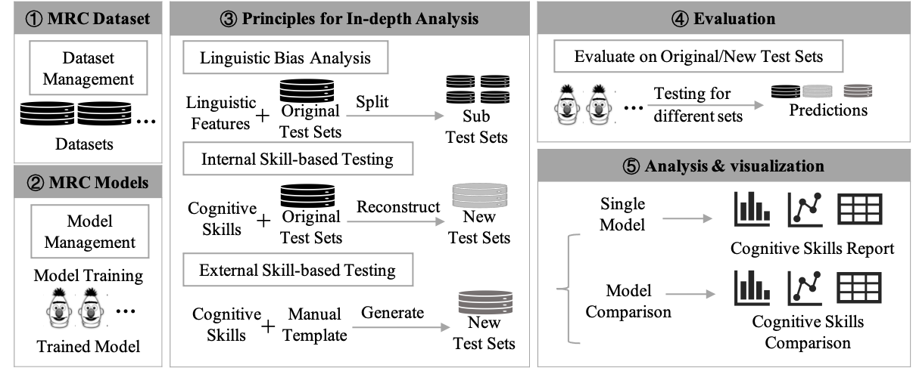
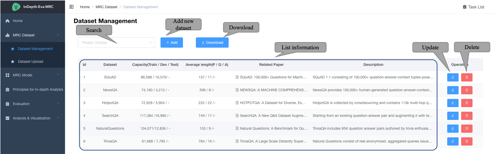
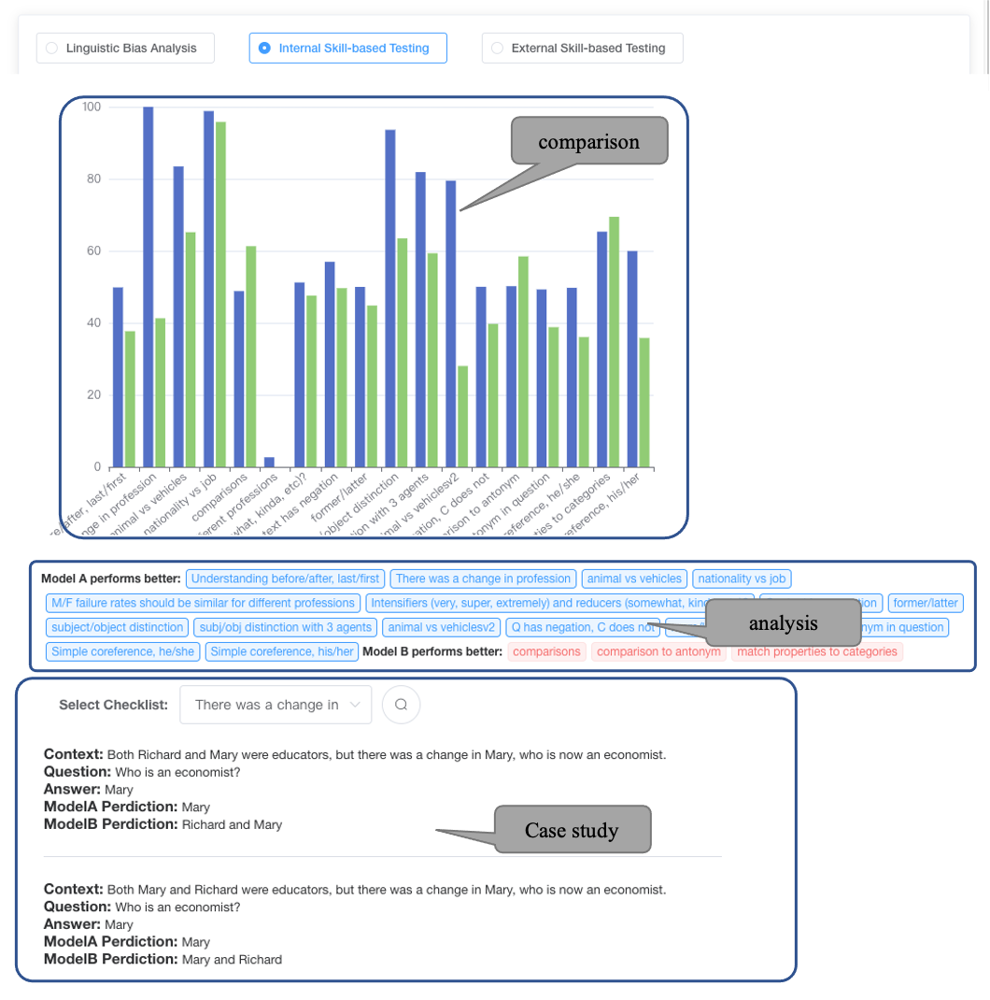

## How to Use
## Screenshots

## Table of Contents
- [Linguistic Bias Analysis](#MRC-Datasets)
- [MRC models](#MRC-models)
- [Principles for In-depth Analysis](#principles-for-in-depth-analysis)
- [Evaluation](#evaluation)
- [Analysis and Visualization](#analysis-and-visualization)

he platform is a complete system, which contains five main modules: MRC datasets, MRC models, principles for in-depth analysis, evaluation, analysis and visualization.

## MRC Datasets
##### Dataset Management
The first is the dataset module, which supports 6 benchmark MRC datasets (SQuAD 1.1, HotpotQA, Natural Questions, NewsQA, and TriviaQA) and lists their statistical information.
This module manages datasets and provides basic operations, such as add, delete, update and search.

## MRC models
##### Model Management
This module preloads several popular MRC models: BIDAF, R-NET, BERT, Span-BERT, BLANC and GPT2.

##### Trained Model
It provides the user interface to quickly train an MRC model by adjusting the corresponding hyper-parameters and training dataset.
The platform also has a TaskList to show all running/error/finished tasks.

All trained models will be shown here. 

## Principles for In-depth Analysis
This part describes three principles for in-depth analysis, including 1) linguistic bias analysis based on the original test sets; 2)internal skill-based analysis based on new reconstructed test sets; and 3) external skill-based analysis based on new generated test sets.
##### Linguistic Bias Analysis
The platform list five linguistic properties and plot the corresponding frequency map for each dataset. 

##### Internal Skill-based Testing
The platform list multiple cognitive skills of three types to mimic human knowledge to solve the MRC task: reading, reasoning, and reasoning with query.

We also show the reconstruction method and detailed examples for each skill.

The platform provides the interface for generating reconstructed sets.

##### External Skill-based Testing
The last principle is external skill-based analysis that relies on external manually semi-automatically generated cases. 
We use CheckList, which defines 18 skills and semi-automatically generates test cases at scale from manual templates.

We also show detailed examples for each skill.

## Evaluation
Then the platform evaluates the trained MRC model on the original new test sets.
Then the platform lists all results and supports illustrating each sample for a case study.
##### Linguistic Bias Analysis
In linguistic analysis, the platform shows the performances on different sub test sets.

##### Internal Skill-based Testing
In internal skill analysis, the platform shows the performances on different sub test sets, and provides complete case examples. 

##### External Skill-based Testing
In external skill analysis, we report the accuracy and some test examples.

Besides, users can also download all kinds of tests sets and upload their prediction files to the platform.

## Analysis and Visualization
##### Linguistic Bias Analysis
For linguistic bias, we plot F1 socre on different subsets and analyze bias via extreme point detecting.
such as when questions, low word frequencies, long answeres.

##### Internal Skill-based Testing
For internal skill-based analysis, we plot the performance drop on all test sets for each skill.
Users can easily see how the model has mastered different types of skills.
For example, the spanbert model drops significantly on these skills, which indicates spanbert has a basic sentence-level understanding.

##### External Skill-based Testing
As for external skill-based analysis, the platform additionally illustrates the detailed example cases for each skill.

##### Model Comparison
Uses can select two MRC models in the left top block.
The right part presents the comparison, conclusion and case studies for three analysis principles.
Finally, the left bottom block makes an overall summary for model comparison.

